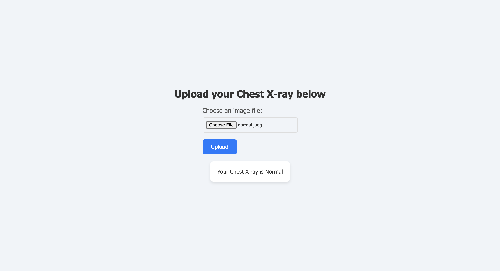

# X-ray Analyzer

This project is aimed to analyze the chest x-rays and identify the condition of the patient. The project leverages a custom developed Convolutional Network to extract the features from the images 

## Project Status

The project is currently deployed on render. To check out the working model visit [link](https://x-ray-check.onrender.com)

## Demo

## Description

This project is an end to end project which involves model creation and training to the deployment of the model. The number of images per group given in the dataset are not much, hence we need to generate more images using the original image, that is by rescaling it, zooming in, cropping. These images in turn are used to train the model and help in increasing the accuracy of the model.
At present the model is giving an accuracy of 89% on the test dataset. 

## Dataset

Kaggle - https://www.kaggle.com/datasets/pranavraikokte/covid19-image-dataset

